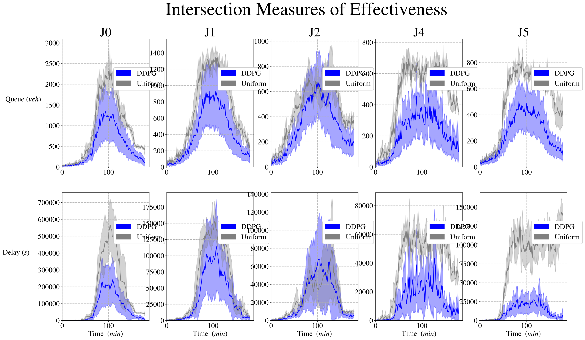
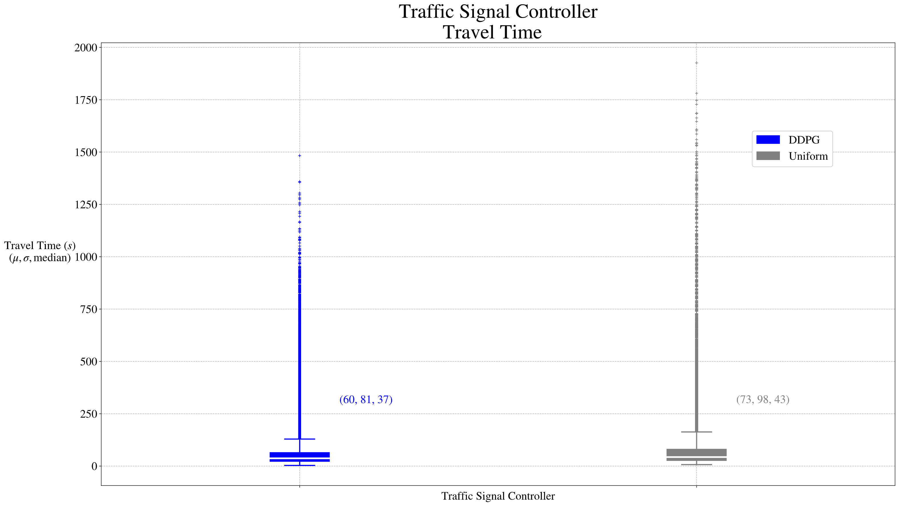

# COMP3071-Design Intelligent Agents / Coursework 2 / Part 1 (30%)

## Introduction

This is COMP3071 Design Intelligent Agents Readme file, hope following information can help you understand our project.

This project use SUMO as simulation environment, choose DDPG(NextDurationRLTSC) as RL agent for each intersection, training mode is CTDE(Centralized Training with Decentralized Execution).

Project use Traci interfact dynamic generate vehicles, there are two generation mode:
1. single: when there is no car in the whole environment, system will generate one, this mode is used to test whether the SUMO env is usable.
2. dynamic: Generate vehicles in a sine wave pattern, starting with fewer, then more, and then fewer again. This is main generation mode used for training and testing.

## Install

<!-- start install -->

### Install SUMO latest version:

1. Install latest SUMO

2. Don't forget to set your "SUMO_HOME"

### IDE:

- Python 3.7.17
- Tensorflow 1.14.0

You can use miniconda to set a Virtual Environment

```bash
conda create -n your_env_name python=3.7.16
```
Activate your VE

```bash
conda activate your_env_name
```

Install Tensorflow 1.14.0 and matplotlib==3.1.1

```bash
pip install tensorflow==1.14.0
pip install matplotlib==3.1.1
```

## Instruction

### Running Command
There are four .sh files:
- train_nsgim_ddpg.sh: Training on NGSIM env command
- test_ngsim_ddpg.sh: Testing on NGSIM env using trained ddpg command
- test_thrnet_ddpg.sh: Testing on THRNET env using trained ddpg command
- test_with_uniform: Testing on NGSIM using uniform method command

You can copy these command to terminal to run the project.

### Files

There are already have trained ddpg model under save_models folder.

You can use test command to test on the net.xml file you want and use this command to generate the results plot.
```bash
python graph_results.py
```

## Parameters of Command
Multi-process parameters:
- n: The number of simulation processes for generating experience in parallel simulation, default value: number of CPU cores - 1
- l: The number of parallel learning processes for generating updates, default value: 1

SUMO simulation parameters:
- sim: simulation scenario, default: lust, options: lust, single, double
- port: port to connect to the server, default: 9000
- netfp: path to the required simulation network file, default: networks/double.net.xml
- sumocfg: path to the required simulation configuration file, default: networks/double.sumocfg
- mode: reinforcement learning mode, training (agents receive updates) or testing (no updates), default: train, options: train, test
- tsc: Traffic signal control algorithm, default: websters, options: sotl, maxpressure, dqn, ddpg
- simlen: Simulation length (seconds/step), default: 10800
- nogui: Disable GUI interface, default: False
- scale: Vehicle generation scale parameter, higher value generates more vehicles, default: 1.4
- demand: Vehicle demand generation mode, single limits the number of network vehicles to 1, dynamic creates a variable number of vehicles, default: dynamic, options: single, dynamic
- offset: The maximum simulation offset as a proportion of the total simulation length, default: 0.25

Traffic signal control shared parameters:
- gmin: minimum green light phase time (seconds), default: 5
- y: yellow light change phase time (seconds), default: 2
- r: all red stop phase time (seconds), default: 3

Reinforcement learning parameters:
- eps: reinforcement learning exploration rate, default: 0.01
- nsteps: n-step reward/maximum experience trajectory, default: 1
- nreplay: maximum size of experience replay, default: 10000
- batch: batch size for training neural network from replay, default: 32
- gamma: reward discount factor, default: 0.99
- updates: total number of batch updates for training, default: 10000
- target_freq: target network batch update frequency, default: 50

Neural network parameters:
- lr: DDPG actor/DQN neural network learning rate, default: 0.0001
- lrc: DDPG critic neural network learning rate, default: 0.001
- lre: neural network optimizer epsilon, default: 0.00000001
- hidden_act: neural network hidden layer activation function, default: elu
- n_hidden: neural network hidden layer scaling factor, default: 3
- save_path: directory to save neural network weights, default: saved_models
- save_replay: directory to save experience replays, default: saved_replays
- load_replay: load experience replays if they exist, default: False
- save_t: interval (seconds) between saves of neural network by the learner, default: 120
- save: use this parameter to save neural network weights, default: False
- load: use this parameter to load existing neural network weights, default: False

DDPG specific parameters
- tau: DDPG online/target weight transfer parameter tau, default: 0.005
- gmax: maximum green phase time (seconds), default: 30

Most of them are not used in real training, because use default value is enough, unless you have some special requirement, or you use the command in the four .sh files that introduced above is enough.
## Results

Training Environment: NGSIM.net.xml


Additional Testing Environment: THRNET.net.xml


There are two method testing on Training Environment:
- RL method: DDPG
- Traditional method: uniform

The traditional method is used for comparision with DDPG to demostrate the training outcomes of DDPG.

There is only one method test on THRNET.net.xml
- RL method: DDPG

Use the DDPG trained by NGSIM.net.xml to test on THRNET.net.xml to confirm that the trained DDPG is adaptative.


### Testing Results on NGSIM.net.xml




### Testing Results on THRNET


